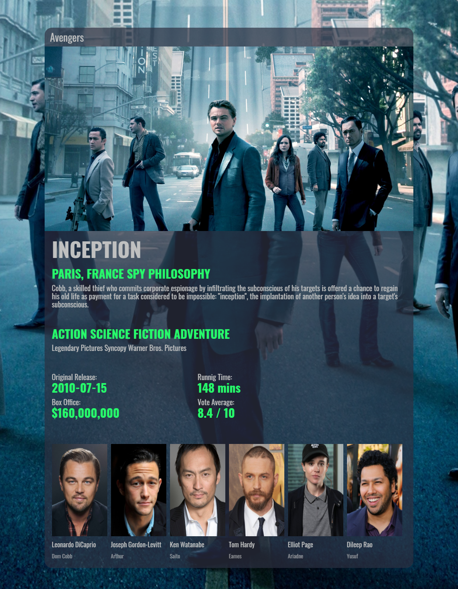

# Movie Box

## Movie Box - это Vue приложение, которое загружает данные через API The Movie Database (TMDb).

## Установка
1. Клонировать репозиторий: `git@github.com:saspovych/movie_box.git`
2. `cd movie_box`
2. Установить пакеты: `npm install`
3. Запустить проект: `npm run serve`
4. Открыть в браузере по адресу: `http://localhost:8080`
